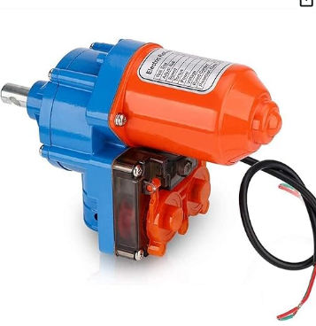
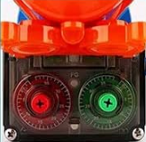
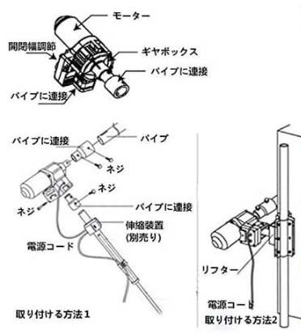
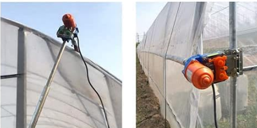
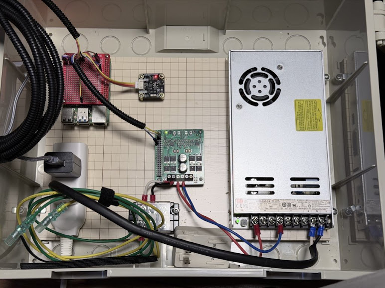

# パーツリスト（BOM）

ビニールハウス自動開閉制御システム

> このドキュメントは Claude（Anthropic）の支援を受けて作成しました。
> 価格・在庫は作成時点（2026-02 頃）の参考値です。変動する場合があります。

---

## メインボード

| 部品名 | 型番・仕様 | 数量 | 備考 |
|--------|-----------|------|------|
| Raspberry Pi | Raspberry Pi 4B または 5 推奨 | 1 | GPIO・I2C・PWM 使用 |
| SD カード | 16GB 以上（Class 10 推奨） | 1 | OS 用。書き込み最小化運用 |
| USB フラッシュメモリ | 32GB 以上（USB 3.0 推奨） | 1 | Docker・HA データ保管用 |
| 電源アダプタ | 5V / 3A 以上（Raspberry Pi 公式推奨） | 1 | |

---

## センサ

| 部品名 | 型番 | I2C アドレス | 数量 | 備考 |
|--------|------|-------------|------|------|
| 温湿度センサ | DFRobot SEN0501 | 0x22 | 1 | 温度・湿度 |
| CO2・温湿度センサ | Sensirion SCD41 | 0x62 | 1 | CO2・温度・湿度 |

---

## モータ制御

| 部品名 | 型番・仕様 | 数量 | 備考 |
|--------|-----------|------|------|
| モータドライバ | Cytron MDD10 | 1 | PWM 20kHz 対応、デュアルチャンネル |
| DC 電動ロールアップモータ | 農業用ビニールハウス巻き上げ機（中華OEM品。型番なし） 24V / 約100W | 1 | Amazon / AliExpress で「電動 ビニールハウス 巻き上げ 24V」等で検索。外部配線は2線（+/-）のみ。**内部に機械式リミットスイッチ内蔵**：設定回転数に達すると内部ギヤがスイッチに接触し内部回路を遮断・自動停止（ダイヤルで開閉幅を調節）。ソフトの最大動作時間制限と合わせて二重の過走防止になる。定格電流 約4.2A、起動突入電流最大 約20A。MDD10 の 10A連続 / 30Aピーク 以内 |

 

 

---

## 電源

> **⚠️ 100V AC 配線には第二種電気工事士の資格が必要です**
>
> スイッチング電源の AC 入力側（コンセント〜電源端子台）への配線は
> 電気工事士法により **第二種電気工事士以上の資格を持つ者が実施**する必要があります。
> 無資格での AC 配線は違法であり、火災・感電の危険があります。

| 部品名 | 型番・仕様 | 数量 | 備考 |
|--------|-----------|------|------|
| Raspberry Pi 用電源アダプタ | 5V / 3A 以上（USB-C）Raspberry Pi 公式推奨 | 1 | Pi のみ専用。モータ電源と別系統 |
| モータ用スイッチング電源 | Mean Well LRS-350-24（24V / 14.6A / 350W） | 1 | AC100-240V 入力、DC24V 出力。MDD10 電源 |

---

## 配線・端子材料

### 配線径の目安

| 区間 | 電線規格（AWG） | 備考 |
|------|---------------|------|
| AC 100V 入力（コンセント〜電源） | **AWG 14**（2.0mm²）以上 | 要電工2種。最大電流に応じて選定 |
| DC 24V 主回路（電源〜MDD10） | **AWG 16**（1.25mm²） | 定格 4.2A、起動電流最大 約20A。AWG 16 の許容電流 13A で通常運用は十分 |
| DC 24V モータ出力（MDD10〜モータ） | **AWG 16**（1.25mm²） | 同上。長配線の場合は電圧降下を考慮して AWG 14 に拡大 |
| GPIO 信号線（Pi〜MDD10 DIR/PWM） | AWG 26（ジャンパワイヤ標準） | 低電流信号線 |
| I2C（Pi〜センサ） | AWG 26〜28 | 低電流信号線 |
| アース（保護接地） | **AWG 14** 以上、黄緑色 | スイッチング電源ケースに接続 |

### 端子・接続材料

| 部品名 | 仕様 | 備考 |
|--------|------|------|
| 絶縁被覆付丸端子 | 対応電線径・ネジ径に合わせて選定 | AC 配線・アース線の固定に使用 |
| 棒端子（フェルール端子） | 対応電線径に合わせて選定 | MDD10・電源端子台の差し込み接続に使用 |
| コルゲートチューブ | 内径 10〜15mm 程度 | 配線保護・まとめ用 |
| ジャンパワイヤ | オス-メス / メス-メス | GPIO 接続用 |
| I2C ケーブル | 4線（SDA / SCL / VCC / GND） | センサ接続用（2本） |

### 筐体

| 部品名 | 仕様 | 備考 |
|--------|------|------|
| 電気工事用プラスチックボックス | IP54 以上推奨（屋外・農場用途） | 各基板・電源を収容。穴あけ加工が必要な場合あり |



---

## GPIO 割当

| GPIO（BCM） | 用途 |
|------------|------|
| GPIO 18 | PWM 出力（モータ速度制御、20kHz） |
| GPIO 23 | DIR 出力（モータ回転方向） |
| SDA (GPIO 2) | I2C データ |
| SCL (GPIO 3) | I2C クロック |

---

## ソフトウェア（無償）

| ソフトウェア | 用途 |
|------------|------|
| Raspberry Pi OS (Trixie) | OS |
| Docker | Home Assistant コンテナ実行 |
| Home Assistant | UI・制御ハブ |
| Cloudflare Tunnel | 外部公開（無料プラン） |
| Python 3 | metrics_server / motor_server |

### Python ライブラリ

```bash
sudo pip install RPi.GPIO adafruit-circuitpython-scd4x dfrobot-environmental-sensor --break-system-packages
```

---

## 注意事項

- **AC 100V 配線は第二種電気工事士以上の有資格者が実施してください。**（電気工事士法）
- モータ用電源（24V）と Raspberry Pi 用電源（5V）は**別系統・別アダプタ**にしてください。
- 棒端子はかしめ工具（フェルールクリンパー）を使用して圧着してください。手でのねじ込みは緩みの原因になります。
- MDD10 の PWM 入力は 3.3V ロジックに対応していますが、接続前にデータシートを確認してください。
- SCD41 は起動後約 5 秒で最初の測定値が得られます（`data_ready` フラグ確認）。
- スイッチング電源（LRS-350-24）のケースは**保護接地（アース）**を必ず接続してください。
